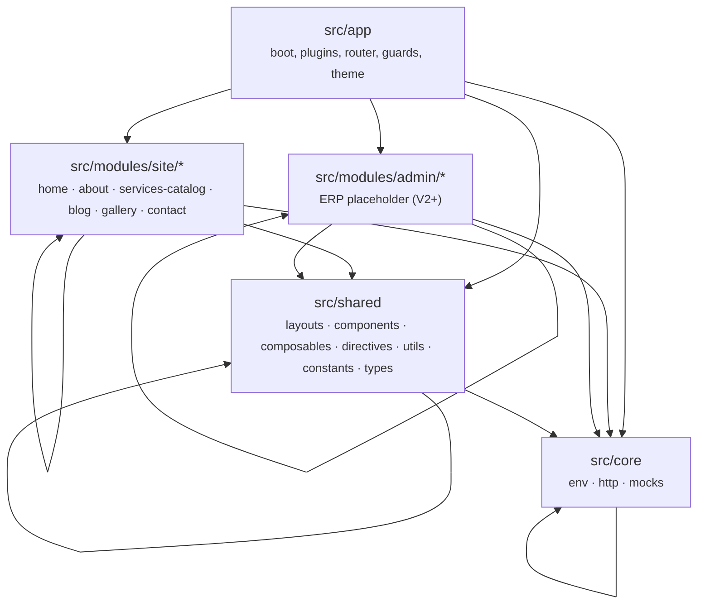
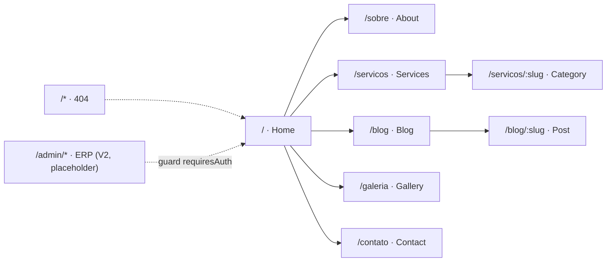
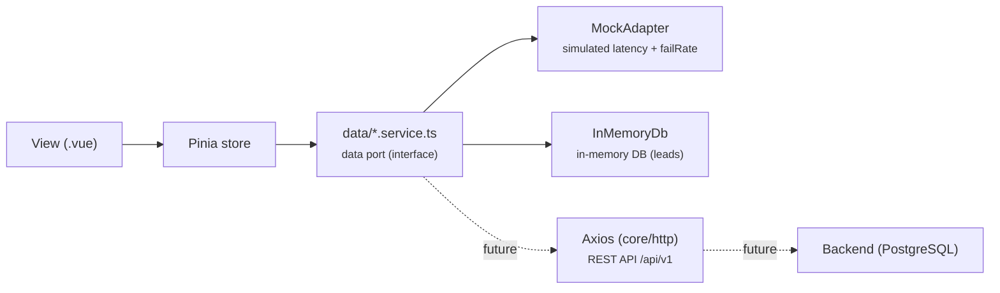
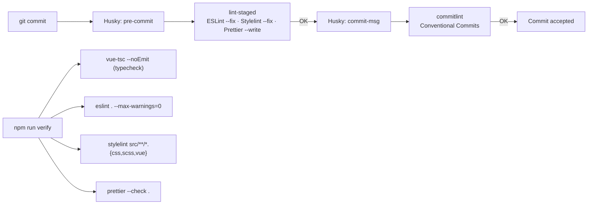

# ENGEVITH — Corporate Website

<p align="center">
  
</p>

> **One-liner:** A frontend-first SPA for ENGEVITH (engineering, surveying, land regularization, construction and environmental solutions) built with **Vue 3 + TypeScript + Vuetify (Material Design 3)**, featuring a domain-modular architecture with lint-enforced dependency rules, a portable data layer (mocks → real API) and end-to-end automated QA.

- 🇧🇷 [Versão em Português](README.pt-BR.md)

---

## Table of contents

1. [Overview](#overview)
2. [Tech stack & rationale](#tech-stack--rationale)
3. [Architecture](#architecture)
4. [Features (modules & routes)](#features-modules--routes)
5. [Data layer (mocks → API)](#data-layer-mocks--api)
6. [Design System · Material Design 3](#design-system--material-design-3)
7. [QA, lint & automation](#qa-lint--automation)
8. [Case study](#case-study)
9. [Getting started](#getting-started)
10. [Deployment](#deployment)

---

## Overview

This is the corporate website of **ENGEVITH** — an engineering company based in Cerqueira César/SP, Brazil (founded 2017). The V1 is **100% front-end**: all data comes from local mocks, but the architecture is designed so that swapping in a real backend (REST API + PostgreSQL) is an implementation change only — no component, store or view needs to change.

Current state (branch `dev`, v0.1.0):

- 6 business modules for the public site (home, about, services, blog, gallery, contact)
- Full public layout (app-bar + mobile drawer + footer), 404 route and route transitions
- Data layer with simulated network latency/failure (UIs already handle loading and error states)
- Admin/ERP routes pre-mapped as placeholders, with the auth guard ready
- Complete QA suite: typecheck, ESLint (with architecture rules), Stylelint, Prettier, unit tests, Husky and commitlint

---

## Tech stack & rationale

| Technology | Version | Why? |
|---|---|---|
| **Vue 3** | ^3.5 | SFCs with `<script setup lang="ts">`, fine-grained reactivity, mature ecosystem, great DX |
| **TypeScript** | ~6.0 | Strict end-to-end typing (via `@vue/tsconfig`), `erasableSyntaxOnly`, zero hidden `any` |
| **Vite** | ^8 | Instant dev server/HMR, native builds, centralized path aliases |
| **Vuetify 3** | ^3.13 | Material componentization with the official **MD3 blueprint**, token-based theming, built-in i18n |
| **@mdi/font** | ^7.4 | Material Design Icons (MD3-consistent) |
| **Pinia** | ^4.0 | Official Vue state management; setup-style stores as composables |
| **Vue Router** | ^5.3 | SPA routing with `createWebHistory`, global guard and `scrollBehavior` |
| **Sass** | ^1.103 | Preprocessor for global styles, variables and mixins |
| **Vitest + @vue/test-utils** | ^4 / ^2.5 | Unit tests in a `jsdom` environment, same bundler as Vite |
| **ESLint 9 (flat config)** | ^9.39 | JS/TS/Vue/a11y linting + **architecture** (`eslint-plugin-boundaries`) + import ordering |
| **Stylelint** | ^16.26 | SCSS/Vue linting (`standard-scss` + `recommended-vue` + `stylelint-order`) |
| **Prettier** | ^3.9 | Deterministic formatting; integrated with lint-staged |
| **Husky + lint-staged + commitlint** | ^9 / ^15 / ^19 | Git hooks: format/lint staged files + Conventional Commits validation |
| **Render** | — | Static SPA deployment from `render.yaml` |

**Key stack decisions:**

- **Vuetify with the MD3 blueprint** instead of hand-rolled CSS: accessible components, semantic color tokens and responsive layout with little custom code, staying consistent with Google's design system.
- **Port/adapter pattern on services** (detailed in the [data section](#data-layer-mocks--api)): this is what enables "V1 without a backend" without hacks.
- **ESLint flat config with `projectService`**: advanced TS-aware linting plus a single, declarative configuration.
- **`.gitattributes` with `eol=lf`**: prevents Windows from breaking the Husky hooks (shebang) and normalizes line endings for the whole team.

---

## Architecture

### Layers and dependency rules

The codebase is organized into 4 layers with **dependencies enforced by `eslint-plugin-boundaries`** (build fails if violated):



Applied rules (configured in `eslint.config.ts`):

| Rule | Effect |
|---|---|
| `boundaries/element-types` | `shared`/`core` **never** import business modules; business modules **never** import other modules directly; only `app` sees everything |
| `boundaries/entry-point` | A module can only be consumed through its **barrel** `index.ts` — deep imports (e.g. `views/Home.vue`) are forbidden outside the module |

Practical consequences: controlled coupling, per-module independent testing, and the ability to extract a module into its own package/library later without refactoring.

### Folder tree

```text
site-engevith/
├── .gitattributes              # universal LF (protects Husky hooks)
├── render.yaml                 # Static deployment on Render (SPA rewrite)
├── README.md / README.pt-BR.md / README.en.md
└── frontend/
    ├── index.html
    ├── vite.config.ts          # aliases: @, @modules, @shared, @core
    ├── vitest.config.ts        # jsdom, globals, inline vuetify
    ├── eslint.config.ts        # flat config + boundaries + perfectionism
    ├── stylelint / prettier / commitlint / lint-staged
    ├── .husky/                 # pre-commit (lint-staged) + commit-msg (commitlint)
    └── src/
        ├── app/                # main.ts, App.vue, theme.ts, plugins/, router/ (+ guards)
        ├── core/               # env.ts, http/ (api-client, interceptors), mocks/
        ├── modules/site/       # 6 business modules (each with index.ts barrel)
        ├── shared/             # layouts/, components/, composables/, directives/, utils/, constants/, types/
        └── styles/             # main.scss (globals) + variables.scss
```

Every business module follows the same internal layout:

```text
src/modules/site/<module>/
├── index.ts            # public barrel (views, components, stores, services, types)
├── views/              # router pages
├── components/         # module-internal components
├── data/               # service (data port) + mock
├── stores/             # Pinia stores (setup-style)
└── types/              # module domain models
```

---

## Features (modules & routes)



### Modules

| Module | Description | Highlights |
|---|---|---|
| **home** | Landing page | `HeroSection` with navy gradient + technical blueprint grid, strategic services grid (consumes the catalog store), differentiators, final CTA |
| **about** | Company info | Who we are, Mission/Vision/Values, differentiators, responsible engineers (CREA), company data (CNPJ/founded/headquarters) |
| **services-catalog** | Service catalog | 6 categories × 42 services (mock). Category list → detail by slug (mock lookup); cards with MDI icons and `v-reveal` animation |
| **blog** | Blog + FAQ | Post list with pt-BR formatted author/date, post page (`white-space: pre-line` content), FAQ accordion in `v-expansion-panels` |
| **gallery** | Media gallery | Responsive image grid with MD3 Lightbox dialog; `IMAGE | VIDEO` typing |
| **contact** | Contact & leads | Validated form (Vuetify rules) that creates a **Lead** in the in-memory DB; contact info + Google Maps embed; `Lead` model already shapes a funnel (NEW → … → WON/LOST) for the future ERP |

**Cross-cutting:** public layout with responsive app-bar (mobile drawer), navy footer with contacts/CNPJ, `fade-slide` route transition, `v-reveal` directive (scroll reveal with `IntersectionObserver` and `prefers-reduced-motion` support) and a 404 page.

---

## Data layer (mocks → API)

The pattern used is **port/adapter**: components and stores depend only on service interfaces; the current implementation reads from mocks but can be swapped for real HTTP calls without touching the UI.



### Pieces in `src/core`

| File | Role |
|---|---|
| `env.ts` | Central config: `APP_NAME`, `API_BASE_URL` (default `/api/v1`) and `MOCK_DELAY_MS` (default 250ms), with typed `ImportMetaEnv` |
| `mocks/mock-adapter.ts` | `resolve<T>()` applies configurable latency and failure rate (`failRate`) — forces views to handle `loading` and errors exactly as with a real API |
| `mocks/in-memory-db.ts` | In-memory "database" (Map of collections) used by `contact.service` to persist leads during the session — single source of truth until PostgreSQL |
| `http/api-client.ts` | Pre-configured HTTP client (`HttpClient` interface) — **reserved** for when the backend exists |
| `http/interceptors.ts` | Bearer-token and error-normalization interceptors — inert today, ready to be wired into Axios |

### Real example: `services-catalog`

- `data/service-catalog.mock.ts` → static data (categories + services)
- `data/service-catalog.service.ts` → `findAllCategories()` / `findCategoryBySlug(slug)` through the `MockAdapter`
- `stores/service-catalog.store.ts` → reactive state (`categories`, `loading`) consumed by `ServicesList.vue` and `StrategicServicesGrid.vue`
- Views never import the mock directly — always through service/store.

> When the backend arrives, just replace the bodies of `data/*.service.ts` to call `api-client` (e.g. `GET /api/v1/services`). No view/store changes.

---

## Design System · Material Design 3

The project adopts **Material Design 3** via Vuetify's **`md3` blueprint** (`vuetify/blueprints`), giving components the MD3 visual language (rounded corners, tonal states, surface elevation) out of the box.

### Custom theme — `src/app/theme.ts`

The `engevithLight` theme defines its palette with **semantic MD3 tokens** (`*-container`, `on-*`, `surface-*` names), not arbitrary colors:

```ts
// Illustrative excerpt (theme.ts)
{
  primary: '#005B9F',            // ENGEVITH institutional blue
  'primary-container': '#D6E3FF',
  tertiary: '#006B5D',           // technical green (accents)
  'tertiary-container': '#BFF5EC',
  secondary: '#535F70',
  'on-surface': '#1A1C20',
  'surface-container-low': '#F3F4F7',
  'engevith-navy': '#0B2437',    // brand color for dark sections (hero/footer)
}
```

| Token (examples) | Usage |
|---|---|
| `background` / `surface` / `surface-container*` | Layout surface layers (sections alternating `bg-surface` and `bg-surface-container-low`) |
| `primary` / `primary-container` | Actions, highlights and category avatars |
| `tertiary` / `tertiary-container` | Technical accents (animated hero rule, icons) |
| `engevith-navy` + `.text-on-dark*` classes | Dark hero and footer with legible text (green/blue on navy) |

### Global defaults (`plugins/vuetify.ts`)

- `VBtn` → `rounded: 'pill'` (pill buttons, MD3 style)
- `VCard` → `rounded: 'xl'`, `elevation: 0`
- `VTextField` / `VTextarea` / `VSelect` → `variant: 'outlined'`
- Icons: `@mdi/font` (Material Design Icons)

### Global styles (`styles/main.scss`)

- `fade-slide` route transition
- `v-reveal` directive (scroll reveal) with a `prefers-reduced-motion: reduce` fallback
- `.engevith-accent-rule` (gradient accent rule) and `--animated` (shimmer)
- `.card-hover` (soft hover elevation)
- Palette mirrored in `variables.scss` (SCSS reference)

### Accessibility & contrast (WCAG AA)

The color choices are not arbitrary: `tests/unit/shared/contrast.spec.ts` **validates by test** that text pairs are ≥ **4.5:1** and UI (icon) pairs ≥ **3:1**, computing relative luminance and ratio per the WCAG algorithm. Additionally:

- `eslint-plugin-vuejs-accessibility` (`flat/recommended`) in ESLint
- `alt` on all images, `title` on the map iframe, keyboard focus/navigation from Vuetify components
- `prefers-reduced-motion` support for animations

---

## QA, lint & automation

### Commit & verification pipeline



### Scripts (package.json)

| Script | Command | What it does |
|---|---|---|
| `dev` | `vite` | Dev server with HMR |
| `build` | `vue-tsc -b && vite build` | Project typecheck + production build |
| `preview` | `vite preview` | Preview the build |
| `test` / `test:watch` / `test:coverage` | `vitest run` / `vitest` / `vitest run --coverage` | Unit tests (jsdom) |
| `lint` | `eslint . --max-warnings=0` | ESLint with zero tolerated warnings |
| `lint:fix` | `eslint . --fix` | ESLint autofix |
| `lint:style` / `lint:style:fix` | `stylelint ...` | CSS/SCSS/Vue lint and autofix |
| `format` / `format:check` | `prettier --write .` / `--check .` | Formatting / verification |
| `typecheck` | `vue-tsc --noEmit` | Standalone type check |
| `verify` | typecheck + lint + lint:style + format:check | **Full QA gate** |

### ESLint (flat config) — highlighted rules

Beyond the recommended configs (`js`, `vue flat/recommended`, `typescript-eslint recommendedTypeChecked`, a11y), the project applies engineering rules:

| Category | Rules |
|---|---|
| **Architecture** | `boundaries/element-types`, `boundaries/entry-point` (see Architecture section) |
| **Dead code** | `unused-imports/no-unused-imports` (error), `no-unused-vars` (warn) |
| **No magic numbers** | `@typescript-eslint/no-magic-numbers` (warn; exceptions: `-1,0,1,2,100`, array indexes, enums, defaults; disabled in `constants/*`, `eslint.config.*` and tests) |
| **Typing** | `no-explicit-any` (error), `explicit-function-return-type`, `explicit-module-boundary-types` |
| **Anti-god-class/component** | `complexity ≤ 10`, `max-lines ≤ 300`, `max-lines-per-function ≤ 60` (80 in `data/*.ts`), `max-params ≤ 4`, `max-classes-per-file = 1`, `max-depth ≤ 3` |
| **Vue** | `block-lang: ts`, `component-name-in-template-casing: PascalCase`, `multi-word-component-names` (with ignores), `no-required-prop-with-default`, `no-setup-props-reactivity-loss`, `require-typed-ref`, `max-attributes-per-line`, `padding-line-between-blocks` |
| **Deterministic ordering** | `perfectionist/sort-imports` (natural, grouped + newlines) — eliminates reordering diffs |
| **Accessibility** | `vuejs-accessibility flat/recommended` |

Per-file overrides: tests (`*.spec.ts`) relax `max-lines-per-function`/`no-magic-numbers`/boundaries; `*.mock.ts` disables `max-lines` (static data, not logic).

### Stylelint

- Extends: `stylelint-config-standard-scss` + `stylelint-config-recommended-vue` (SCSS + `<style>` in `.vue` via `postcss-html`)
- `stylelint-order`: ordered properties (custom-properties → declarations)
- `declaration-no-important` as warning (discourages `!important`)
- Convention rules (e.g. `selector-class-pattern`) disabled where they don't apply

### Prettier

- No semicolons, single quotes, trailing commas (`all`), `printWidth: 100`, `tabWidth: 2`, `endOfLine: lf`, always `arrowParens`

### Git hooks (Husky)

- `pre-commit` → `cd frontend && npx lint-staged` (runs from repo root)
- `commit-msg` → `commitlint` with `@commitlint/config-conventional`, restricting `type-enum` to `feat, fix, refactor, style, docs, test, chore`

### Unit tests (Vitest)

| Spec | Covers |
|---|---|
| `shared/slug.spec.ts` | `slugify()`: kebab-case and accent removal |
| `shared/contrast.spec.ts` | WCAG AA contrast of **all** theme color pairs (text ≥ 4.5:1, UI ≥ 3:1) |
| `modules/site/home/hero-section.spec.ts` | Mounts `HeroSection` with real Vuetify + router: renders title and CTAs |

Config: `environment: 'jsdom'`, `globals: true`, `css: false`, `vuetify` inlined (avoids ESM issues), coverage with `text` + `html`.

---

## Case study

### Context

ENGEVITH needed a corporate website that presents an extensive catalog of technical services (42 services in 6 areas), generates **qualified leads**, and serves as the foundation for a future **internal ERP** (project, lead, client and team management).

### The problem: "frontend-first" without a backend

With no API or database available initially, the goal was to deliver real value in V1 without incurring technical debt. Two approaches would have been wrong:

1. **Hardcoding in the view** — scattered data, impossible to evolve to an API without a rewrite.
2. **Mocks in the component + "we'll deal with it later"** — UI coupled to fake data and missing loading/error states.

### Decision and trade-offs

| Decision | Rationale | Trade-off |
|---|---|---|
| **Data layer as port/adapter** (`data/*.service.ts` + `MockAdapter`) | Views/stores depend on *interfaces*, not implementations; swapping mock → HTTP is a service-only edit | Slightly more initial code (one extra layer) |
| **MockAdapter with latency and `failRate`** | UI is born handling `loading`, skeleton and errors — identical behavior to a real API | (negligible cost) |
| **`InMemoryDb` for leads** | The contact form already persists to a "database" and models the `Lead` domain with a status funnel | Data is lost on reload (accepted for a mock) |
| **Boundaries enforced by lint from the first commit** | Controlled coupling and independent modules; no silent dependency leaks | One more rule for devs to learn |
| **No-magic-numbers + size limits** | Avoids scattered constants and "god" components; easier code reviews | More rigor in PRs |
| **WCAG contrast tests on the theme** | Accessibility becomes a *gate*, not an intention; safe color changes | Extra test to maintain |

### Results and planned evolution

- ✅ V1 delivered 100% front-end, with real UI (loading/error), automated QA and an MD3 design system.
- 🔜 **V2**: REST API (Node or other) exposing `/api/v1`; `data/*.service.ts` switch to `core/http/api-client`; interceptors wired for **JWT**; PostgreSQL replacing `InMemoryDb`.
- 🔜 **Admin/ERP**: routes already mapped (`admin.routes.ts`) with `meta: { requiresAuth: true }` and the guard ready; the `modules/admin` domain will reuse the same `core`/`shared` base. The `Lead`/`LeadStatus` model (NEW → CONTACTED → QUALIFIED → PROPOSAL → WON/LOST) is already the CRM funnel.

---

## Getting started

Prerequisites: Node.js 20+ and npm.

```bash
cd frontend
npm ci            # reproducible install
npm run dev       # dev server → http://localhost:5173
```

Build and QA:

```bash
npm run verify     # full gate: typecheck + lint + lint:style + format:check
npm run test       # unit tests (Vitest)
npm run test:coverage
npm run build      # typecheck + production build → dist/
npm run preview    # serve the build locally
```

### Environment variables (optional)

| Variable | Default | Description |
|---|---|---|
| `VITE_APP_NAME` | `ENGEVITH` | Application name |
| `VITE_API_BASE_URL` | `/api/v1` | Future API base URL |
| `VITE_MOCK_DELAY_MS` | `250` | Simulated mock latency |

---

## Deployment

Deployment is a **static site on [Render](https://render.com)** via `render.yaml` (Infra as Code):

```yaml
services:
  - type: static
    name: engevith-frontend
    rootDir: frontend
    buildCommand: npm ci && npm run build
    publishPath: dist
    routes:
      - type: rewrite
        source: /*
        destination: /index.html   # SPA: every route falls back to index
```

The `/*` → `/index.html` rewrite ensures routes like `/servicos/engenharia` work with history mode (no 404 on refresh). The build runs `vue-tsc` before Vite, so **a typecheck failure blocks the deployment**.

---

## Repo & conventions

- Main development branch: `dev`
- Commits follow **Conventional Commits** (`feat`, `fix`, `refactor`, `style`, `docs`, `test`, `chore`) — validated by commitlint
- **LF** line endings across the repo (`.gitattributes`) — keeps Windows from breaking hooks
- VS Code extension recommendations in `frontend/.vscode/extensions.json` (ESLint, Prettier, Stylelint, Volar) with format-on-save and fix-on-save configured

---

<p align="center">
  <sub>Built with Vue 3 · Vuetify MD3 · Pinia · Vitest · ESLint · Stylelint · Prettier · Husky</sub>
</p>
