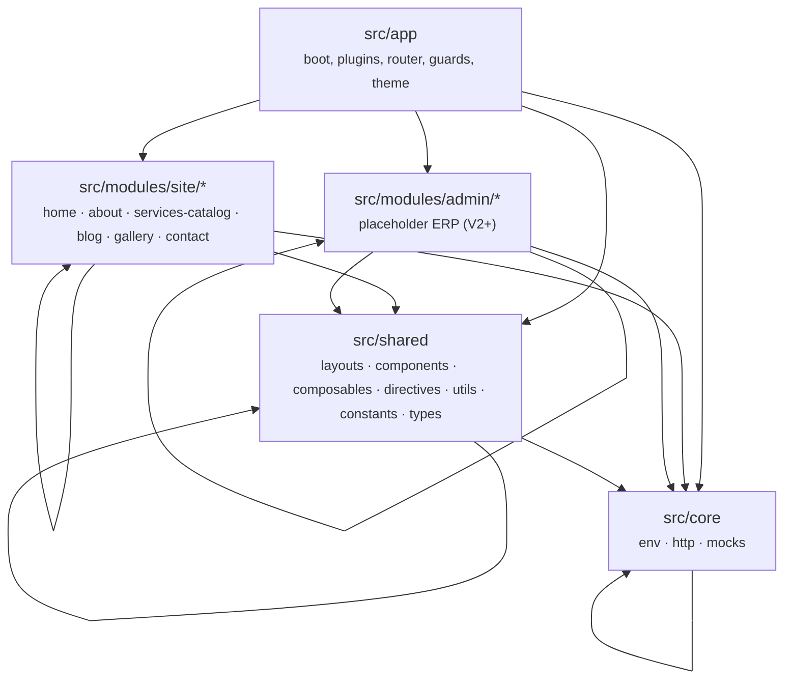
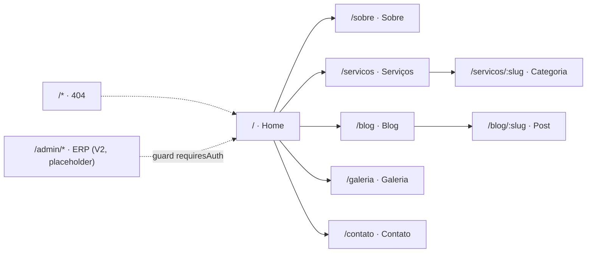
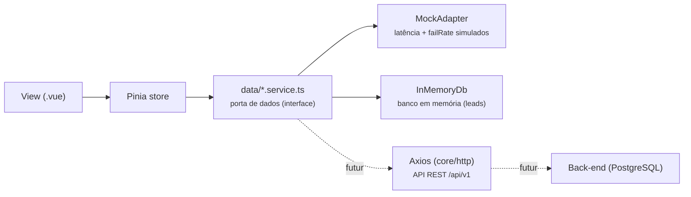
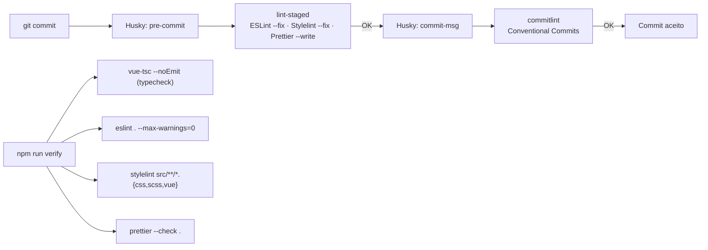

# ENGEVITH — Site Institucional

<p align="center">
  
</p>

> **Uma linha:** SPA front-end-first da ENGEVITH (engenharia, topografia, regularização, obras e meio ambiente) construída em **Vue 3 + TypeScript + Vuetify (Material Design 3)**, com arquitetura modular por domínio, regras de dependência forçadas por lint, camada de dados portável (mocks → API real) e QA automatizado de ponta a ponta.

- 🌐 [English version](README.en.md)

---

## Sumário

1. [Visão geral](#visão-geral)
2. [Tecnologias e justificativas](#tecnologias-e-justificativas)
3. [Arquitetura](#arquitetura)
4. [Features (módulos e rotas)](#features-módulos-e-rotas)
5. [Camada de dados (mocks → API)](#camada-de-dados-mocks--api)
6. [Design System · Material Design 3](#design-system--material-design-3)
7. [QA, lint e automação](#qa-lint-e-automação)
8. [Estudo de caso](#estudo-de-caso)
9. [Como rodar](#como-rodar)
10. [Deploy](#deploy)

---

## Visão geral

O projeto é o site institucional da **ENGEVITH** — empresa de engenharia sediada em Cerqueira César/SP (fundada em 2017). A V1 é **100% front-end**: todos os dados vêm de mocks locais, mas a arquitetura foi desenhada para que a troca por um back-end real (API REST + PostgreSQL) seja um swap de implementação — sem alterar componentes, stores ou views.

Estado atual (branch `dev`, v0.1.0):

- 6 módulos de negócio do site público (home, sobre, serviços, blog, galeria, contato)
- Layout público completo (app-bar + drawer mobile + footer), rota 404 e transições de rota
- Camada de dados com simulação de latência/falha de rede (as UI já tratam loading e erro)
- Rotas de administração/ERP mapeadas como placeholder, com guard de autenticação pronto
- Suite completa de QA: typecheck, ESLint (com arquitetura), Stylelint, Prettier, testes unitários, Husky e commitlint

---

## Tecnologias e justificativas

| Tecnologia | Versão | Por quê? |
|---|---|---|
| **Vue 3** | ^3.5 | SFC com `<script setup lang="ts">`, reatividade fina, ecossistema maduro e DX excelente |
| **TypeScript** | ~6.0 | Tipagem estrita de ponta a ponta (`strict` via `@vue/tsconfig`), `erasableSyntaxOnly`, zero `any` disfarçado |
| **Vite** | ^8 | Build/dev server instantâneos, HMR nativo, aliases de path centralizados |
| **Vuetify 3** | ^3.13 | Componentização Material com **blueprint MD3** oficial, tema customizável por tokens e i18n de idiomas embutida |
| **@mdi/font** | ^7.4 | Ícones Material Design Icons (consistente com MD3) |
| **Pinia** | ^4.0 | Gerenciamento de estado oficial do Vue; stores *setup-style* com composables |
| **Vue Router** | ^5.3 | Rotas SPA com `createWebHistory`, guard global e `scrollBehavior` |
| **Sass** | ^1.103 | Pré-processador para estilos globais, variáveis e mixins |
| **Vitest + @vue/test-utils** | ^4 / ^2.5 | Testes unitários em ambiente `jsdom`, mesmo bundler do Vite |
| **ESLint 9 (flat config)** | ^9.39 | Lint JS/TS/Vue/a11y + **arquitetura** (`eslint-plugin-boundaries`) + ordenação de imports |
| **Stylelint** | ^16.26 | Lint de SCSS/Vue (`standard-scss` + `recommended-vue` + `stylelint-order`) |
| **Prettier** | ^3.9 | Formatação determinística; integrado ao lint-staged |
| **Husky + lint-staged + commitlint** | ^9 / ^15 / ^19 | Git hooks: formata/lint nos arquivos staged + validação de Conventional Commits |
| **Render** | — | Deploy estático (SPA) a partir do `render.yaml` |

**Decisões-chave de stack:**

- **Vuetify com blueprint MD3** em vez de CSS puro: entrega componentes acessíveis, tokens de cor semânticos e responsividade com pouco código próprio, mantendo consistência com o design system do Google.
- **Porta/adapter nos services** (detalhado na [seção de dados](#camada-de-dados-mocks--api)): é o que permite "V1 sem back-end" sem gambiarra.
- **ESLint flat config** com `projectService`: tipagem avançada do TS dentro do ESLint e configuração única e declarativa.
- **`.gitattributes` com `eol=lf`**: evita que o Windows quebre os hooks do Husky (shebang) e normaliza os finais de linha para todo o time.

---

## Arquitetura

### Camadas e regras de dependência

A base do código é organizada em 4 camadas, com **dependências garantidas por `eslint-plugin-boundaries`** (falha de build se violar):



Regras aplicadas (configuradas em `eslint.config.ts`):

| Regra | Efeito |
|---|---|
| `boundaries/element-types` | `shared`/`core` **nunca** importam módulos de negócio; módulos de negócio **nunca** importam outros módulos diretamente; só `app` enxerga todos |
| `boundaries/entry-point` | Um módulo só pode ser consumido pelo **barrel** `index.ts` — imports por caminho interno (ex.: `views/Home.vue`) são proibidos fora do módulo |

Consequências práticas: acoplamento controlado, testes independentes por módulo e a possibilidade de extrair um módulo para um pacote/biblioteca no futuro sem refatoração.

### Árvore de pastas

```text
site-engevith/
├── .gitattributes              # LF universal (protege hooks do Husky)
├── render.yaml                 # Deploy estático no Render (SPA rewrite)
├── README.md / README.pt-BR.md / README.en.md
└── frontend/
    ├── index.html
    ├── vite.config.ts          # aliases: @, @modules, @shared, @core
    ├── vitest.config.ts        # jsdom, globals, inline vuetify
    ├── eslint.config.ts        # flat config + boundaries + perfeccionismo
    ├── stylelint / prettier / commitlint / lint-staged
    ├── .husky/                 # pre-commit (lint-staged) + commit-msg (commitlint)
    └── src/
        ├── app/                # main.ts, App.vue, theme.ts, plugins/, router/ (+ guards)
        ├── core/               # env.ts, http/ (api-client, interceptors), mocks/
        ├── modules/site/       # 6 módulos de negócio (cada um com barrel index.ts)
        ├── shared/             # layouts/, components/, composables/, directives/, utils/, constants/, types/
        └── styles/             # main.scss (globais) + variables.scss
```

Cada módulo de negócio segue o mesmo layout interno:

```text
src/modules/site/<modulo>/
├── index.ts            # barrel público (exporta views, components, stores, services, types)
├── views/              # páginas do router
├── components/         # componentes internos do módulo
├── data/               # service (porta de dados) + mock
├── stores/             # Pinia stores (setup-style)
└── types/              # modelos de domínio do módulo
```

---

## Features (módulos e rotas)



### Módulos

| Módulo | Descrição | Destaques |
|---|---|---|
| **home** | Landing page | `HeroSection` com gradiente navy + grid de blueprint técnico, grade de serviços estratégicos (consome a store do catálogo), diferenciais, CTA final |
| **about** | Institucional | Quem somos, Missão/Visão/Valores, diferenciais, engenheiros responsáveis (CREA), dados da empresa (CNPJ/fundação/sede) |
| **services-catalog** | Catálogo de serviços | 6 categorias × 42 serviços (mock). Lista de categorias → detalhe por slug (com busca no mock); cards com ícones MDI e animação `v-reveal` |
| **blog** | Blog + FAQ | Lista de posts com autor/data formatada em pt-BR, página de post (conteúdo com `white-space: pre-line`), painel de FAQ em `v-expansion-panels` |
| **gallery** | Galeria de mídia | Grade responsiva de imagens com Lightbox (dialog MD3); tipagem `IMAGE | VIDEO` |
| **contact** | Contato e leads | Formulário validado (Vuetify rules) que cria um **Lead** no banco em memória; infos + mapa embed do Google; modelo `Lead` já modela funil (NEW → … → WON/LOST) para o futuro ERP |

**Transversal:** layout público com app-bar responsiva (drawer no mobile), footer navy com contatos/CNPJ, transição de rota `fade-slide`, diretiva `v-reveal` (scroll reveal com `IntersectionObserver` e `prefers-reduced-motion`) e página 404.

---

## Camada de dados (mocks → API)

O padrão usado é **porta/adapter**: os componentes e stores dependem apenas de interfaces de serviço; a implementação atual lê de mocks, mas pode ser trocada por chamadas HTTP reais sem tocar na UI.



### Peças em `src/core`

| Arquivo | Papel |
|---|---|
| `env.ts` | Config central: `APP_NAME`, `API_BASE_URL` (default `/api/v1`) e `MOCK_DELAY_MS` (default 250ms), com tipagem de `ImportMetaEnv` |
| `mocks/mock-adapter.ts` | `resolve<T>()` aplica latência configurável e taxa de falha (`failRate`) — força as views a tratarem `loading` e erro exatamente como numa API real |
| `mocks/in-memory-db.ts` | "Banco" em memória (Map de coleções) usado pelo `contact.service` para persistir leads durante a sessão — single source of truth até o PostgreSQL |
| `http/api-client.ts` | Cliente HTTP pré-configurado (interface `HttpClient`) — **reservado** para quando o back-end existir |
| `http/interceptors.ts` | Interceptors de Bearer token e normalização de erro — hoje inertes, prontos para acoplar ao Axios |

### Exemplo real: `services-catalog`

- `data/service-catalog.mock.ts` → dados estáticos (categorias + serviços)
- `data/service-catalog.service.ts` → `findAllCategories()` / `findCategoryBySlug(slug)` passando pelo `MockAdapter`
- `stores/service-catalog.store.ts` → estado reativo (`categories`, `loading`) consumido por `ServicesList.vue` e `StrategicServicesGrid.vue`
- Views nunca importam o mock diretamente — sempre via service/store.

> Ao chegar o back-end, basta substituir o corpo dos `data/*.service.ts` para chamar `api-client` (ex.: `GET /api/v1/services`). Nenhuma view/store muda.

---

## Design System · Material Design 3

O projeto adota o **Material Design 3** por meio do **blueprint `md3` do Vuetify** (`vuetify/blueprints`), garantindo componentes com a linguagem visual MD3 (cantos arredondados, tonalidade, estados de superfície) por padrão.

### Tema customizado — `src/app/theme.ts`

O tema `engevithLight` define a paleta com **tokens semânticos MD3** (nomes `*-container`, `on-*`, `surface-*`), não cores arbitrárias:

```ts
// Trecho ilustrativo (theme.ts)
{
  primary: '#005B9F',            // azul institucional ENGEVITH
  'primary-container': '#D6E3FF',
  tertiary: '#006B5D',           // verde técnico (accents)
  'tertiary-container': '#BFF5EC',
  secondary: '#535F70',
  'on-surface': '#1A1C20',
  'surface-container-low': '#F3F4F7',
  'engevith-navy': '#0B2437',    // cor de marca para seções escuras (hero/footer)
}
```

| Token (exemplos) | Uso |
|---|---|
| `background` / `surface` / `surface-container*` | Camadas de superfície do layout (seções alternando `bg-surface` e `bg-surface-container-low`) |
| `primary` / `primary-container` | Ações, destaques e avatares de categorias |
| `tertiary` / `tertiary-container` | Accents técnicos (regra animada do hero, ícones) |
| `engevith-navy` + classes `.text-on-dark*` | Hero e footer escuros com texto legível (verde/azul sobre navy) |

### Defaults globais (`plugins/vuetify.ts`)

- `VBtn` → `rounded: 'pill'` (botões pílula, padrão MD3)
- `VCard` → `rounded: 'xl'`, `elevation: 0`
- `VTextField` / `VTextarea` / `VSelect` → `variant: 'outlined'`
- Ícones: `@mdi/font` (Material Design Icons)

### Estilos globais (`styles/main.scss`)

- Transição de rota `fade-slide`
- Diretiva `v-reveal` (scroll reveal) com fallback para `prefers-reduced-motion: reduce`
- `.engevith-accent-rule` (regra de destaque com gradiente) e `--animated` (shimmer)
- `.card-hover` (elevação suave em hover)
- Paleta espelhada em `variables.scss` (referência SCSS)

### Acessibilidade e contraste (WCAG AA)

A escolha de cores não é arbitrária: `tests/unit/shared/contrast.spec.ts` **valida por teste** que os pares de texto ≥ **4.5:1** e pares de UI (ícones) ≥ **3:1**, calculando luminância relativa e ratio conforme o algoritmo WCAG. Além disso:

- `eslint-plugin-vuejs-accessibility` (regras `flat/recommended`) no ESLint
- `alt` em todas as imagens, `title` no iframe do mapa, foco e navegação via teclado dos componentes Vuetify
- Suporte a `prefers-reduced-motion` para as animações

---

## QA, lint e automação

### Pipeline de commit e verificação



### Scripts (package.json)

| Script | Comando | O que faz |
|---|---|---|
| `dev` | `vite` | Dev server com HMR |
| `build` | `vue-tsc -b && vite build` | Typecheck em projeto + build de produção |
| `preview` | `vite preview` | Pré-visualiza o build |
| `test` / `test:watch` / `test:coverage` | `vitest run` / `vitest` / `vitest run --coverage` | Testes unitários (jsdom) |
| `lint` | `eslint . --max-warnings=0` | ESLint sem tolerar warnings |
| `lint:fix` | `eslint . --fix` | Autofix do ESLint |
| `lint:style` / `lint:style:fix` | `stylelint ...` | Lint e autofix de CSS/SCSS/Vue |
| `format` / `format:check` | `prettier --write .` / `--check .` | Formatação / verificação |
| `typecheck` | `vue-tsc --noEmit` | Checagem de tipos isolada |
| `verify` | typecheck + lint + lint:style + format:check | **Gate completo de QA** |

### ESLint (flat config) — regras de destaque

Além dos configs recomendados (`js`, `vue flat/recommended`, `typescript-eslint recommendedTypeChecked`, a11y), o projeto aplica regras de engenharia:

| Categoria | Regras |
|---|---|
| **Arquitetura** | `boundaries/element-types`, `boundaries/entry-point` (ver seção Arquitetura) |
| **Código morto** | `unused-imports/no-unused-imports` (error), `no-unused-vars` (warn) |
| **Anti-magic-number** | `@typescript-eslint/no-magic-numbers` (warn; exceções: `-1,0,1,2,100`, índices, enums, defaults; desligada em `constants/*`, `eslint.config.*` e testes) |
| **Tipagem** | `no-explicit-any` (error), `explicit-function-return-type`, `explicit-module-boundary-types` |
| **Anti-god-class/component** | `complexity ≤ 10`, `max-lines ≤ 300`, `max-lines-per-function ≤ 60` (80 em `data/*.ts`), `max-params ≤ 4`, `max-classes-per-file = 1`, `max-depth ≤ 3` |
| **Vue** | `block-lang: ts`, `component-name-in-template-casing: PascalCase`, `multi-word-component-names` (com ignores), `no-required-prop-with-default`, `no-setup-props-reactivity-loss`, `require-typed-ref`, `max-attributes-per-line`, `padding-line-between-blocks` |
| **Ordenação determinística** | `perfectionist/sort-imports` (natural, com grupos + newline) — elimina diffs de reordenação |
| **Acessibilidade** | `vuejs-accessibility flat/recommended` |

Oversights por tipo de arquivo: testes (`*.spec.ts`) têm `max-lines-per-function`/`no-magic-numbers`/boundaries relaxados; `*.mock.ts` tem `max-lines` desligado (dados estáticos, não lógica).

### Stylelint

- Extends: `stylelint-config-standard-scss` + `stylelint-config-recommended-vue` (SCSS + `<style>` de `.vue` via `postcss-html`)
- `stylelint-order`: propriedades ordenadas (custom-properties → declarations)
- `declaration-no-important` como warning (desencoraja `!important`)
- Regras de convenção (ex.: `selector-class-pattern`) desligadas pontualmente onde não se aplicam

### Prettier

- Sem ponto e vírgula, aspas simples, vírgula final (`all`), `printWidth: 100`, `tabWidth: 2`, `endOfLine: lf`, sempre `arrowParens`

### Git hooks (Husky)

- `pre-commit` → `cd frontend && npx lint-staged` (roda do repo raiz)
- `commit-msg` → `commitlint` com `@commitlint/config-conventional`, restringindo `type-enum` a `feat, fix, refactor, style, docs, test, chore`

### Testes unitários (Vitest)

| Spec | Cobre |
|---|---|
| `shared/slug.spec.ts` | `slugify()`: kebab-case e remoção de acentos |
| `shared/contrast.spec.ts` | Contraste WCAG AA de **todos** os pares de cor do tema (texto ≥ 4.5:1, UI ≥ 3:1) |
| `modules/site/home/hero-section.spec.ts` | Mount do `HeroSection` com Vuetify + router reais: renderiza título e CTAs |

Configuração: `environment: 'jsdom'`, `globals: true`, `css: false`, `vuetify` inline (evita problemas de ESM), coverage com `text` + `html`.

---

## Estudo de caso

### Contexto

A ENGEVITH precisava de um site institucional que apresentasse um catálogo extenso de serviços técnicos (42 serviços em 6 áreas), gerasse **leads** qualificados e servisse de fundação para um futuro sistema de **ERP interno** (gestão de projetos, leads, clientes e equipe).

### O problema: "frontend-first" sem back-end

Sem API nem banco disponíveis no início, era preciso entregar valor real já na V1 sem criar dívida técnica. Duas abordagens seriam erradas:

1. **Hardcode na view** — dados espalhados, impossível evoluir para API sem reescrever tudo.
2. **Mocks no componente + "depois resolvemos"** — UI acoplada a dados falsos e sem estados de carregamento/erro.

### Decisão e trade-offs

| Decisão | Racional | Trade-off |
|---|---|---|
| **Camada de dados como porta/adapter** (`data/*.service.ts` + `MockAdapter`) | Views/stores dependem de *interfaces*, não de implementação; trocar mock → HTTP é editar só o service | Código inicial levemente maior (uma camada extra) |
| **MockAdapter com latência e `failRate`** | UI nasce tratando `loading`, `skeleton` e erro — comportamento idêntico ao de uma API real | (sem custo relevante) |
| **`InMemoryDb` para leads** | O formulário de contato já persiste em "banco" e modela o domínio `Lead` com funil de status | Dados se perdem ao recarregar (aceito: mock) |
| **Boundaries forçadas por lint desde o commit 1** | Acoplamento controlado e módulos independentes; impossível "vazar" dependência silenciosamente | Regra a mais para os devs aprenderem |
| **Anti-magic-numbers + limites de tamanho** | Evita constantes espalhadas e componentes "god"; código mais fácil de revisar | Mais rigor nas PRs |
| **Testes de contraste WCAG no tema** | Acessibilidade vira *gate*, não intenção; mudanças de cor seguras | Teste extra a manter |

### Resultados e evolução prevista

- ✅ V1 entregue 100% front-end, com UI real (loading/erro), QA automatizado e design system MD3.
- 🔜 **V2**: API REST (Node/ou outro) expondo `/api/v1`; `data/*.service.ts` passam a usar `core/http/api-client`; `interceptors` acoplados para **JWT**; PostgreSQL no lugar do `InMemoryDb`.
- 🔜 **Admin/ERP**: rotas já mapeadas (`admin.routes.ts`) com `meta: { requiresAuth: true }` e guard pronto; o domínio `modules/admin` consumirá a mesma `core/shared` base. O modelo `Lead`/`LeadStatus` (NEW → CONTACTED → QUALIFIED → PROPOSAL → WON/LOST) já é o funil do CRM.

---

## Como rodar

Pré-requisito: Node.js 20+ e npm.

```bash
cd frontend
npm ci            # instala dependências (reprodutível)
npm run dev       # dev server → http://localhost:5173
```

Build e QA:

```bash
npm run verify     # gate completo: typecheck + lint + lint:style + format:check
npm run test       # testes unitários (Vitest)
npm run test:coverage
npm run build      # typecheck + build de produção → dist/
npm run preview    # serve o build localmente
```

### Variáveis de ambiente (opcionais)

| Variável | Default | Descrição |
|---|---|---|
| `VITE_APP_NAME` | `ENGEVITH` | Nome da aplicação |
| `VITE_API_BASE_URL` | `/api/v1` | Base URL futura da API |
| `VITE_MOCK_DELAY_MS` | `250` | Latência simulada dos mocks |

---

## Deploy

O deploy é feito como **site estático no [Render](https://render.com)** via `render.yaml` (Infra as Code):

```yaml
services:
  - type: static
    name: engevith-frontend
    rootDir: frontend
    buildCommand: npm ci && npm run build
    publishPath: dist
    routes:
      - type: rewrite
        source: /*
        destination: /index.html   # SPA: qualquer rota cai no index
```

O `rewrite` de `/*` para `/index.html` garante que rotas como `/servicos/engenharia` funcionem com history mode (sem 404 no refresh). O build roda `vue-tsc` antes do Vite, então **falha de typecheck bloqueia o deploy**.

---

## Repo & convenções

- Branch principal de desenvolvimento: `dev`
- Commits seguem **Conventional Commits** (`feat`, `fix`, `refactor`, `style`, `docs`, `test`, `chore`) — validados por commitlint
- Finais de linha **LF** em todo o repo (`.gitattributes`) — evita que o Windows quebre hooks
- Recomendações de extensões do VS Code em `frontend/.vscode/extensions.json` (ESLint, Prettier, Stylelint, Volar) com format-on-save e fix-on-save configurados

---

<p align="center">
  <sub>Feito com Vue 3 · Vuetify MD3 · Pinia · Vitest · ESLint · Stylelint · Prettier · Husky</sub>
</p>
